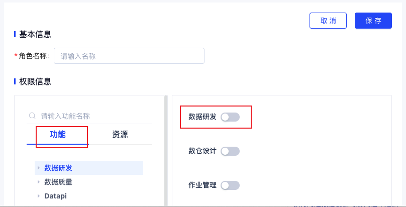
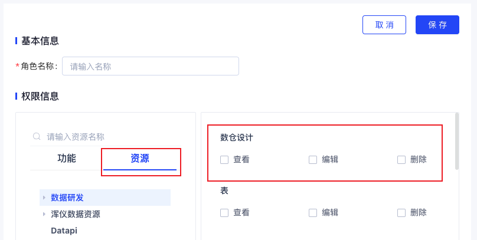
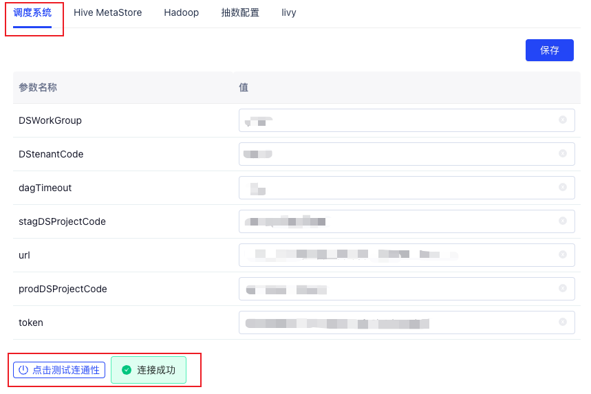
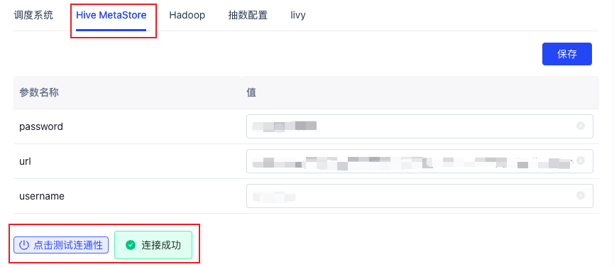
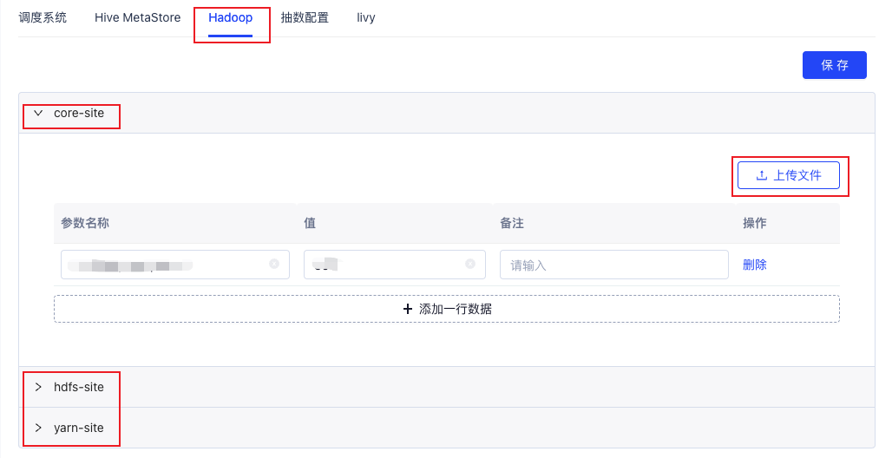
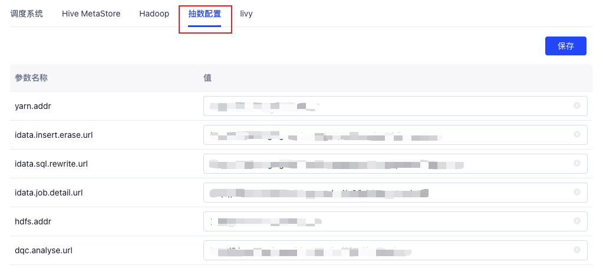
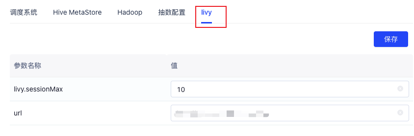
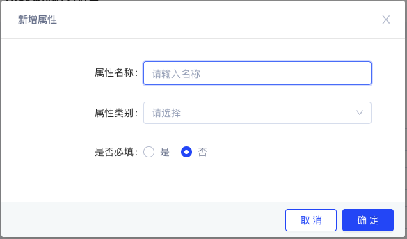

# 系统配置

包括权限管理、应用配置、集成配置、LDAP配置、元数据属性配置模块。

## 权限管理

包括角色管理、用户管理、用户组管理。可对功能菜单、资源、数据权限进行授权

### 角色管理

角色管理模块，用户能够通过对 IData 各个菜单和功能权限的控制，根据日常使用需求对平 台用户进行角色划分，从而进行权限控制。

#### 新增角色

路径：系统配置—权限管理—角色管理—新增角色

1. 在系统配置菜单下，选择权限管理，点击**【新增角色】**按钮，进入新增页面；

2. 在“角色新增”页内，填写角色选择“功能”标签页，选中需要配置的菜单功能，在右侧进行功能的**开启**和**关闭**

   

3. 在“角色新增”页内，选择“资源”标签页，选中需要配置的资源，在右侧进行资源的**选中**和**取消**

   

### 新增用户

新增用户由系统管理员操作

### 新增用户组

用户组管理模块，将用户分组后，根据业务需求分配数据权限。

*具体待开发*

## 应用管理

【待补充】

## 集成配置

集成配置模块，用户能够通过参数值的输入将 IData 与调度系统、Hadoop、抽数等工具平台进行连接。

配置项包括调度系统、Hive MetaStore、Hadoop、抽数配置、livy

### 调度系统

支持与**DolphinScheduler**进行集成，用于离线作业的自动调度：

字段说明

| 参数              | 描述                                                         |
| :---------------- | ------------------------------------------------------------ |
| DSWorkGroup       | DolphinScheduler 工作组                                      |
| DStenantCode      | DolphinScheduler 租户code                                    |
| dagTimeout        | DolphinScheduler 工作流默认的超时时间                        |
| stagDSProjectCode | DolphinScheduler 项目的编号，创建一个项目后获取，对应IData中的真线环境对应 |
| url               | DolphinScheduler restful接口地址                             |
| prodDSProjectCode | olphinScheduler 项目的编号，创建一个项目后获取，对应IData中的预发环境 |
| token             | DolphinScheduler 接口访问token，需在DolphinScheduler 中创建一个用户，然后生成该用户的token |

点击测试连通性，显示连接成功，即可点击保存。

### Hive MetaStore

url字段为Hive Metastore元数据库地址。 username和password为元数据库用户名和密码。

### Hadoop

core-site、hdfs-site和yarn-site即Hadoop官方core-site.xml、hdfs-site.xml和yarn-site.xml文件的解析内容，支持XML文件上传自动解析。

### 抽数配置

用于数据集成相关作业，数据抽取和数据回流。

字段说明：

| 参数                   | 说明                                                         |
| ---------------------- | ------------------------------------------------------------ |
| arn.addr               | yarn RM地址+端口                                             |
| idata.insert.erase.url | idata内置方法，http://${host}:${port}/api/p0/dev/spark/insertErase |
| idata.sql.rewrite.url  | idata内置方法，http://${host}:${port}/api/p0/dev/spark/addDatabaseEnv |
| idata.job.detail.url   | idata内置方法，http://${host}:${port}/api/p0/job/execute-detail |
| hdfs.addr              | namenode 地址+端口                                           |
| dqc.analyse.url        | http://idata-staging.cai-inc.com/api/dqc/dqc/analyse         |

### Livy

用于作业调试等功能；

url为Livy的url路径；livy.sessionMax为Livy可同时存在最大session数量；

## LDAP

用户能够通过LDAP配置中配置的LDAP相关信息，方便对接您当前正在使用的LDAP实现用户登录权限功能。

## 元数据属性配置

主要用于数仓设计中的多场景下表单页面的配置，可以在元数据属性配置页面查看和编辑多模块的表单页面。

进入元数据属性配置页面，选择上方tab为表单基本信息或表结构设计，其中表单基本信息是面向数仓设计中表信息，表结构设计面向数仓设计中表结构设计信息。

1. 点击**系统配置**>**元数据属性配置**页面。
2. 单击页面末端的**新增属性**，在**新增属性**对话框中，配置各项参数。

| 参数     | 描述                                                         |
| -------- | :----------------------------------------------------------- |
| 属性名称 | 表单页面展示的元件名称。                                     |
| 属性类别 | 表单元件类型，仅支持输入框、选择器和布尔单选器。 1. 选择选择器后，需点击添加一行数据增加下拉选项。 |
| 是否必填 | 在表单页面是否为必填项，在保存时进行校验。                   |

3. 点击**确定**后在页面处展示。
4. 点击元件后的**编辑**已创建元件标签， 点击**删除**已创建元件标签。

## 应用管理

【待编辑】

